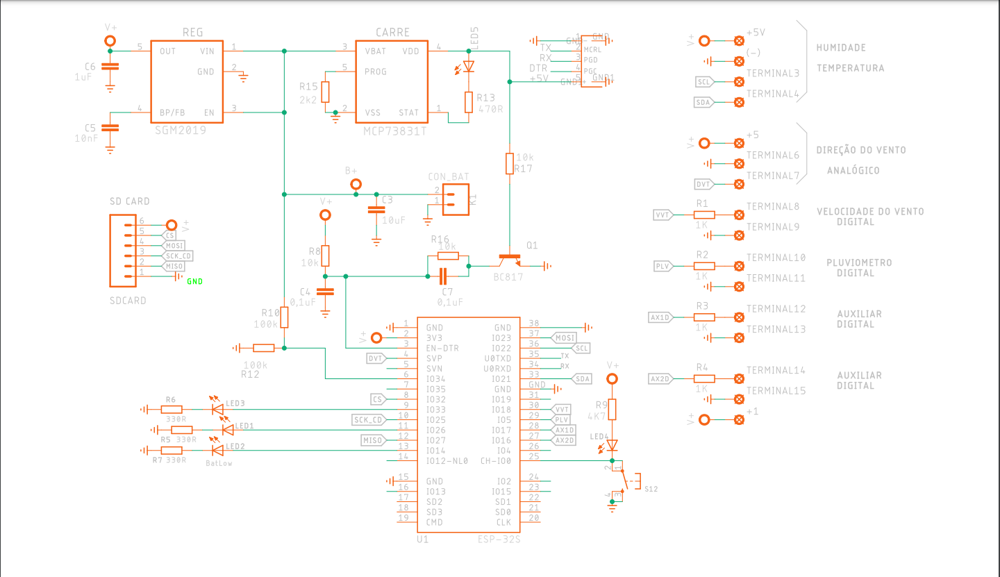

	
	 
	 

# MeteoroSense
## Sistema Embarcado para captação de dados meteorológicos

Este repositório contém o código-fonte de um sistema integrado de gestão meteorológica para a Universidade Federal do Rio de Janeiro (UFRJ).

## Como usar

Para usar o sistema, você precisará:

1. Clonar o repositório.
2. Instalar as dependências.
3. Configurar o sistema.

Para obter mais informações, consulte a documentação do sistema.

# Circuitos

Para esse projeto, desenvolvemos uma placa customizada baseada no microcontrolador ESP-32. Esta placa foi concebida com o intuito específico de atender às exigências do projeto, proporcionando um conjunto abrangente de funcionalidades para a coleta e processamento de dados meteorológicos. Integrando uma gama de sensores e um design eficiente, a placa oferece um desempenho excepcional. Além disso, sua arquitetura versátil permite uma fácil integração com outros componentes do sistema, tornando-a uma escolha ideal para otimizar a operação.

Dedicamos atenção especial à economia de recursos durante o processo de fabricação, visando minimizar os custos de produção. Implementamos estratégias para alcançar esse objetivo, sem comprometer a qualidade ou desempenho da placa. Isso resultou em uma solução acessível e viável, permitindo uma ampla utilização em diversas aplicações meteorológicas, desde projetos pessoais até implantações em larga escala.

	
	 
	 

## Contato

Para mais informações, entre em contato com o autor do projeto:

* [Lucas Fonseca Barreto](https://github.com/fonsecaBarreto)
Use o código com cuidado.

# Dependencies
 * [DHT-sensor-library](https://github.com/adafruit/DHT-sensor-library)
 * [NTPClient](https://github.com/arduino-libraries/NTPClient)
 * [PubSubClient](https://github.com/knolleary/pubsubclient)
 * [Adafruit_BMP085](https://github.com/adafruit/Adafruit-BMP085-Library)